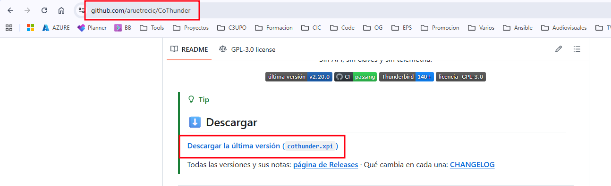
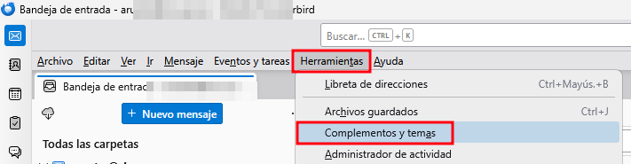
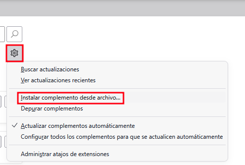
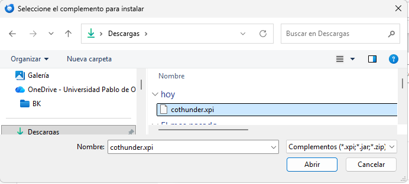
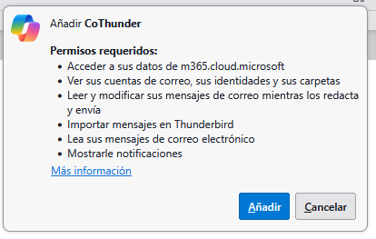
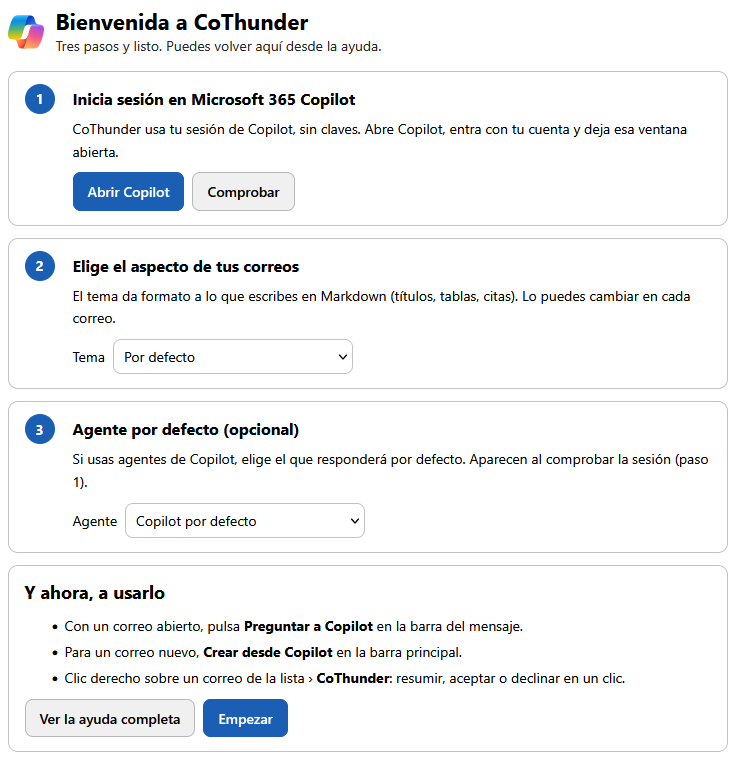
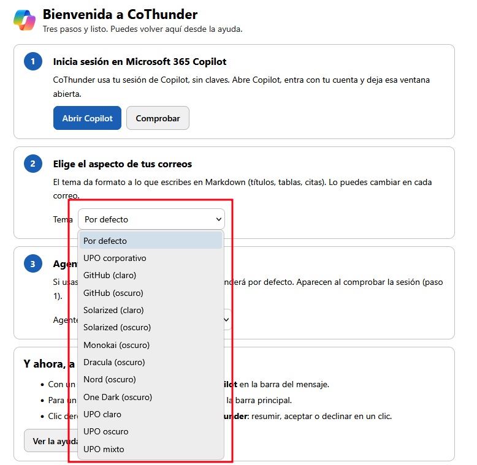

# Instalar CoThunder

Guía con capturas para instalar CoThunder en **Thunderbird ESR 140 o superior**. Para el uso diario, consulta el [manual de uso](MANUAL.md).

## 1. Descarga el complemento

Entra en [github.com/aruetrecic/CoThunder](https://github.com/aruetrecic/CoThunder) y pulsa **Descargar la última versión (`cothunder.xpi`)**. El fichero se guarda en tu carpeta *Descargas*.

## 2. Abre «Complementos y temas»

En Thunderbird, ve a **Herramientas › Complementos y temas**.

## 3. Instala desde el fichero

En el **Administrador de complementos**, pulsa el engranaje **⚙** junto a *Administre sus extensiones* y elige **Instalar complemento desde archivo…**.

Selecciona `cothunder.xpi` en *Descargas* y pulsa **Abrir**.

## 4. Acepta los permisos

Thunderbird muestra los permisos que necesita CoThunder (acceso a Copilot en `m365.cloud.microsoft`, leer tus cuentas y mensajes, redactar y mostrar notificaciones). Pulsa **Añadir**.

Qué se hace con cada permiso: [informe de seguridad](SEGURIDAD.md).

## 5. Configuración inicial

Se abre la pantalla **Bienvenida a CoThunder**, con tres pasos:

1. **Inicia sesión en Microsoft 365 Copilot**: pulsa **Abrir Copilot**, entra con tu cuenta y deja esa ventana abierta. Luego pulsa **Comprobar**.
2. **Elige el aspecto de tus correos**: el *Tema* que da formato a lo que escribes en Markdown.
3. **Agente por defecto** (opcional): si usas agentes de Copilot, elige el que responderá por defecto. La lista se rellena al comprobar la sesión del paso 1.

Los temas disponibles son: Por defecto, UPO corporativo, GitHub, Solarized, Monokai, Dracula, Nord, One Dark y las variantes UPO claro, oscuro y mixto. Puedes cambiarlo después en cada correo.

Pulsa **Empezar** y listo. Puedes volver a esta pantalla desde la ayuda.

## Actualizar

Repite los pasos 1 a 4 con la versión nueva: se conservan tus ajustes y plantillas.
